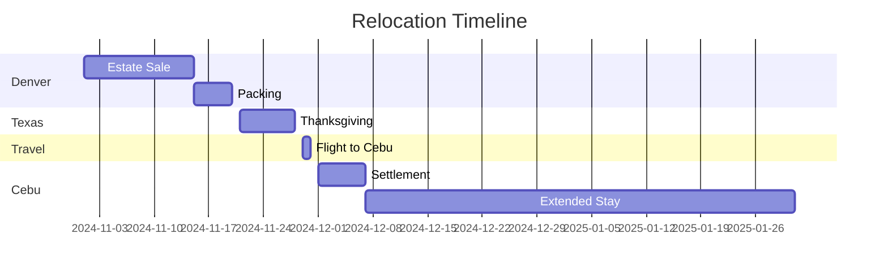

# 🌴 Cebu City Relocation Project

[](/)
[](/)
[](/)

A comprehensive project management repository for coordinating relocation from Denver to Cebu City, including estate sale management, international travel planning, and establishing a 2-month base in Cebu City, Philippines.

## 🎯 Project Overview

This repository tracks the planning and execution of a three-phase relocation project:

1. **Denver Phase** (November 2024)
   - Estate sale coordination
   - Property disposition
   - Logistical planning

2. **Texas Phase** (Thanksgiving 2024)
   - Family time
   - Item storage
   - Travel preparation

3. **Cebu City Phase** (December 2024 - January 2025)
   - Housing establishment
   - Local orientation
   - Cultural integration

## 📁 Repository Structure

```
cebu-relocation/
├── pre-departure/          # Denver and Texas planning
├── travel/                 # Flight and document arrangements
├── cebu-life/             # Living in Cebu resources
└── resources/             # General reference materials
```

## 🚀 Quick Start

### Priority Tasks
1. [ ] Complete estate sale inventory
2. [ ] Confirm flight bookings (Denver → Texas → Tokyo → Cebu)
3. [ ] Research Airbnb options in Cebu
4. [ ] Gather required travel documents

### Key Deadlines
- Estate Sale: [Date TBD]
- Texas Arrival: [Date TBD]
- Cebu City Arrival: [Date TBD]

## 📍 Location Details

### Cebu City Overview
- **Location**: Central Visayas, Philippines
- **Population**: ~1.8 million
- **Climate**: Tropical monsoon
- **Language**: Cebuano, Filipino, English
- **Time Zone**: UTC+8

### Target Areas for Housing
- IT Park
- Ayala Area
- Mactan Island
- Cebu Business Park

## 📱 Essential Apps & Services

### Transportation
- Grab
- Angkas
- Local taxi services

### Food & Delivery
- Food Panda
- Grab Food
- Local delivery options

### Communication
- WhatsApp
- Viber
- Local SIM options

## 🏃‍♂️ Getting Started

1. Clone this repository
```bash
git clone https://github.com/crazystorm720/cebu-relocation
cd cebu-relocation
```

2. Review and update the pre-departure checklist
```
pre-departure/denver/checklist.md
```

3. Start tracking progress using the project boards
```
GitHub Projects Tab → Relocation Timeline
```

## 📊 Progress Tracking

- [ ] Denver Phase
  - [ ] Estate sale planning
  - [ ] Item categorization
  - [ ] Shipping arrangements

- [ ] Texas Phase
  - [ ] Thanksgiving planning
  - [ ] Storage arrangements
  - [ ] Travel preparation

- [ ] Cebu Phase
  - [ ] Housing secured
  - [ ] Local transportation plan
  - [ ] Communication setup

## 🔍 Resources

### Official Links
- [Cebu City Government Portal](https://www.cebucity.gov.ph/)
- [Philippines Bureau of Immigration](https://immigration.gov.ph/)
- [US Embassy in Philippines](https://ph.usembassy.gov/)

### Local Resources
- [Cebu City Tourism](/)
- [ExpatGuide Philippines](/)
- [Cebu Digital Nomads Group](/)

## 🆘 Emergency Contacts

- 🚔 Police: [Number]
- 🚑 Emergency: [Number]
- 🏥 Hospitals: [List in resources/emergency-info.md]
- 🎫 US Consular Agency Cebu: [Number]

## 📝 Contributing

This is a personal project, but suggestions and recommendations are welcome through:
- Opening an Issue
- Creating a Pull Request
- Adding to the Wiki

## 📅 Timeline Overview



## 🔄 Updates

This repository is actively maintained and updated throughout the relocation process. Check the commit history for the latest changes and additions.

## ⚖️ License

This repository is private and maintained for personal use. All rights reserved.

---

Repository Description (for GitHub):
```
🌴 Personal relocation project management repository tracking transition from Denver to Cebu City, including estate sale coordination, international travel planning, and 2-month stay establishment in the Philippines.
```

Tags:
- relocation
- project-management
- cebu-city
- philippines
- travel-planning
- estate-sale
- international-move
